# Java-Based Online Quiz Platform

A role-based **Online Quiz Platform built with Java** that allows
administrators and quiz creators to manage quizzes while participants
can take timed quizzes and review their own results.

The project includes both the original Java desktop implementation and a
connected browser-based edition. In the web edition, the browser
communicates with a Java HTTP server; Java handles authentication,
authorization, quiz workflows, scoring, timing, and SQL persistence.

> **Project status:** Review 1 implementation with a working browser
> interface, Java backend, JDBC persistence, role-based access control,
> quiz approval workflow, timed attempts, and result reporting.

## Live Application

**Live Website:** https://quiz-platform-virginia.onrender.com

### Evaluation access

This repository is public, so passwords, setup tokens, database URLs, and other
secrets are intentionally **not** stored in source control.

- **Quiz Creator / Participant:** evaluators can create a normal account from
  the application and test the corresponding workflow.
- **Administrator:** the Admin account is already configured on the hosted
  application. Its credentials should be supplied only in the evaluator-only
  submission material (for example, the submitted report/PPT or private
  submission notes), not in this public README.

For a complete evaluation, the recommended flow is:

1. Open the live website.
2. Sign in as Administrator using the credentials supplied with the private
   evaluation material and review users/quizzes/results.
3. Create or sign in to a Quiz Creator account, create a quiz, and submit it
   for approval.
4. Approve the quiz as Administrator.
5. Create or sign in to a Participant account, attempt the approved quiz, and
   review the saved result.

------------------------------------------------------------------------

## Table of Contents

-   [Project Overview](#project-overview)
-   [Main Features](#main-features)
-   [User Roles and Permissions](#user-roles-and-permissions)
-   [Application Workflow](#application-workflow)
-   [Technology Stack](#technology-stack)
-   [Application Screenshots and
    Walkthrough](#application-screenshots-and-walkthrough)
-   [Database Design and Persistence](#database-design-and-persistence)
-   [Java and Review 1 Concepts](#java-and-review-1-concepts)
-   [Project Structure](#project-structure)
-   [Requirements](#requirements)
-   [Running the Web Application
    Locally](#running-the-web-application-locally)
-   [Running the Desktop Application](#running-the-desktop-application)
-   [First-Time Setup](#first-time-setup)
-   [Deploying the Web Application](#deploying-the-web-application)
-   [Security Notes](#security-notes)
-   [Testing and Verification](#testing-and-verification)
-   [Important Behaviour and
    Limitations](#important-behaviour-and-limitations)

------------------------------------------------------------------------

## Project Overview

The **Java-Based Online Quiz Platform** is designed to provide a
complete quiz workflow rather than a static quiz demo.

The system supports three different user roles:

1.  **Admin**
2.  **Quiz Creator**
3.  **Participant**

Each account is stored in the database with its actual role. After
login, the application uses that role to decide which pages, records,
and actions the user is allowed to access.

A typical workflow is:

**Creator creates quiz → Creator submits quiz → Admin reviews quiz →
Admin approves quiz → Participant attempts quiz → System scores attempt
→ Result is stored → Authorized users review results**

The browser application and API are served from the same Java web
server. This means the frontend is not an independent mock-up: its
buttons and pages are connected to the Java backend and SQL database.

------------------------------------------------------------------------

## Main Features

The application includes:

-   User registration and login
-   First-administrator setup
-   Role-based authorization
-   Admin user management
-   Quiz creation and editing
-   Four-option multiple-choice questions
-   Correct-answer and explanation storage
-   Draft, Pending, Approved, and Rejected quiz states
-   Admin quiz approval and rejection
-   Rejection feedback for quiz creators
-   Timed quiz attempts
-   Automatic submission when time expires
-   Answer saving during an active attempt
-   Browser refresh/resume support
-   Automatic scoring
-   Multiple attempts
-   Result history
-   Question-by-question answer review
-   Historical result snapshots
-   JDBC-based SQL persistence
-   Transaction management
-   Local H2 database support
-   Hosted PostgreSQL support
-   Docker deployment configuration
-   Role-specific dashboards

------------------------------------------------------------------------

## User Roles and Permissions

### Admin

The **Admin** has the highest level of application access.

An administrator can:

-   View the Admin dashboard.
-   Create and manage user accounts.
-   Assign supported roles to users.
-   Edit users.
-   Delete users when record-preservation rules allow it.
-   View quizzes created in the system.
-   Create quizzes.
-   Inspect quiz questions, options, correct answers, and explanations.
-   Edit quizzes.
-   Approve quizzes submitted by creators.
-   Reject quizzes and provide a rejection reason.
-   View submitted quiz results across the platform.
-   Open detailed result reports.

The Admin therefore has access to management features that are
intentionally unavailable to Participants.

### Quiz Creator

A **Quiz Creator** is responsible for preparing quiz content.

A creator can:

-   Create quizzes.
-   Set the quiz title, category, and duration.
-   Add and edit questions.
-   Provide four options for each question.
-   Select the correct answer.
-   Add an explanation.
-   Save a quiz as a draft.
-   Submit a quiz for Admin approval.
-   See approval/rejection status and feedback.
-   Manage only quizzes they are authorized to manage.
-   View results associated with their own quizzes.

A Creator does **not** receive Admin user-management privileges and
cannot approve their own quiz as an administrator would.

### Participant

A **Participant** is the quiz-taking role.

A participant can:

-   View approved quizzes available to them.
-   Open quiz details before starting.
-   Start or resume a timed attempt.
-   Select one answer for each question.
-   Navigate between questions.
-   Submit the quiz.
-   Have the quiz automatically submitted when time expires.
-   View their score.
-   Review their selected answers and the correct answers after
    completion.
-   View their own previous attempts through **My results**.

Participants are deliberately restricted from administrative
information. For example, they cannot open the Admin **Manage users**
page or browse everybody's results. Their result area is limited to
results they are permitted to access, principally their own attempts.

### Permission Summary

  ----------------------------------------------------------------------------
  Feature                 Admin           Quiz Creator         Participant
  ---------------- ------------------- ------------------- -------------------
  Login                    Yes                 Yes                 Yes

  View                     Yes                 Yes                 Yes
  role-specific                                            
  dashboard                                                

  Manage users             Yes                 No                  No

  Create quizzes           Yes                 Yes                 No

  Edit permitted           Yes                 Yes                 No
  quizzes                                                  

  Submit quiz for       Yes/where              Yes                 No
  approval             applicable                          

  Approve/reject           Yes                 No                  No
  quiz                                                     

  View approved      Management view     Management view           Yes
  quizzes for                                              
  attempting                                               

  Attempt quiz          No normal           No normal              Yes
                       participant         participant     
                        workflow            workflow       

  View all                 Yes                 No                  No
  platform results                                         

  View results for         Yes                 Yes                 No
  creator's own                                            
  quizzes                                                  

  View own attempt    As authorized       As authorized            Yes
  history                                                  
  ----------------------------------------------------------------------------

------------------------------------------------------------------------

## Application Workflow

### 1. Account setup and login

On a fresh database, the first administrator is created through the
protected setup process. After setup, users sign in using their email
address and password.

Creator and Participant accounts can be registered through the
application or created by an administrator.

### 2. Quiz creation

A Creator creates a quiz and enters:

-   Title
-   Category
-   Duration
-   Questions
-   Four answer options per question
-   Correct option
-   Explanation

The quiz can be saved as a **Draft**.

### 3. Approval workflow

When ready, the Creator submits the quiz for review.

The status moves through the workflow:

`Draft → Pending → Approved`

or:

`Draft → Pending → Rejected`

If rejected, the Admin supplies a reason so the Creator knows what needs
to be changed.

Editing a completed/approved quiz causes it to return to a state
requiring approval again before Participants can use the updated
version.

### 4. Participant attempt

Only an approved quiz is presented to Participants for normal
quiz-taking.

When an attempt begins:

-   A deadline is recorded.
-   The timer starts.
-   Answers are saved as the Participant works.
-   The Participant can navigate between questions.
-   Refreshing the browser can restore an active attempt.
-   When time expires, the server can finalize the attempt
    automatically.

### 5. Submission and scoring

When the Participant submits, the application calculates the score
automatically.

Each correct answer earns one point. Wrong or unanswered questions earn
zero.

### 6. Results

The completed attempt is stored in SQL.

A Participant can review their own result, including:

-   Score
-   Number of correct answers
-   Time used
-   Selected answer
-   Correct answer
-   Question explanation

Admins have a broader results view, while Creators can access results
related to their own quizzes.

------------------------------------------------------------------------

# Application Screenshots and Walkthrough

## 1. Login Page

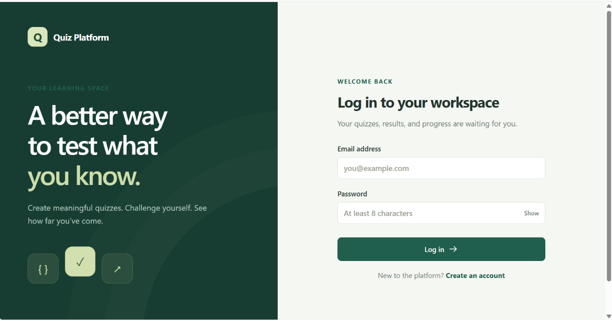

The login page is the entry point to the platform. A registered user
enters an email address and password. The system authenticates the
account against the Java backend and database.

The application does not ask the user to manually choose a role during
login. The role is obtained from the authenticated database record,
preventing a Participant from simply selecting "Admin" on the login
screen.

The page also provides account creation for new supported non-admin
users.

------------------------------------------------------------------------

## 2. Admin Dashboard

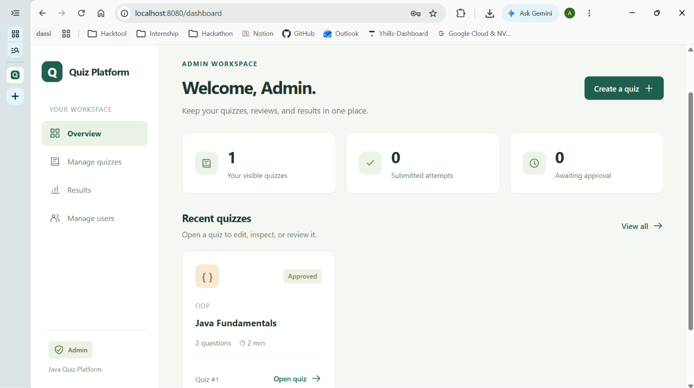

After an administrator logs in, the **Admin Workspace** is displayed.

The dashboard provides a quick overview of platform activity, including
visible quizzes, submitted attempts, and quizzes awaiting approval.

The left navigation exposes Admin-specific areas such as:

-   Overview
-   Manage quizzes
-   Results
-   Manage users

These options demonstrate role-based UI behavior. A Participant, for
example, does not receive the **Manage users** section.

------------------------------------------------------------------------

## 3. Admin --- Manage Users

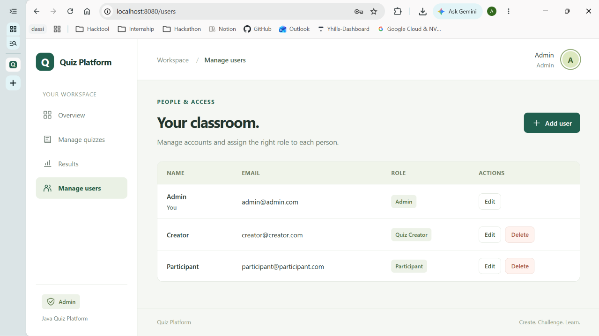

The **Manage users** page allows an administrator to manage the people
who can use the platform.

The table displays information such as:

-   Name
-   Email
-   Role
-   Available actions

In the screenshot, the system contains an Admin, Quiz Creator, and
Participant. The administrator can edit accounts and, where allowed by
data-integrity rules, delete accounts.

The signed-in administrator is protected from actions that would leave
the current session without its required Admin identity.

------------------------------------------------------------------------

## 4. Admin --- Manage Quizzes

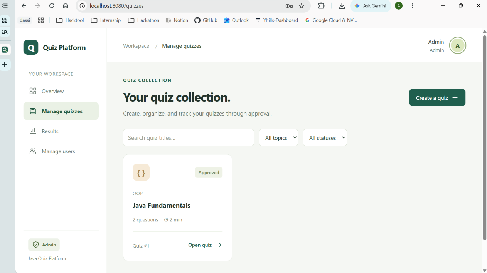

The **Manage quizzes** page gives the Admin a centralized view of quiz
content.

The Admin can search/filter quizzes, inspect quiz status, open a quiz,
create content, and perform the review workflow.

Quiz states include:

-   Draft
-   Pending
-   Approved
-   Rejected

Only approved quizzes are made available to Participants for the normal
attempt workflow.

------------------------------------------------------------------------

## 5. Quiz Creator Dashboard

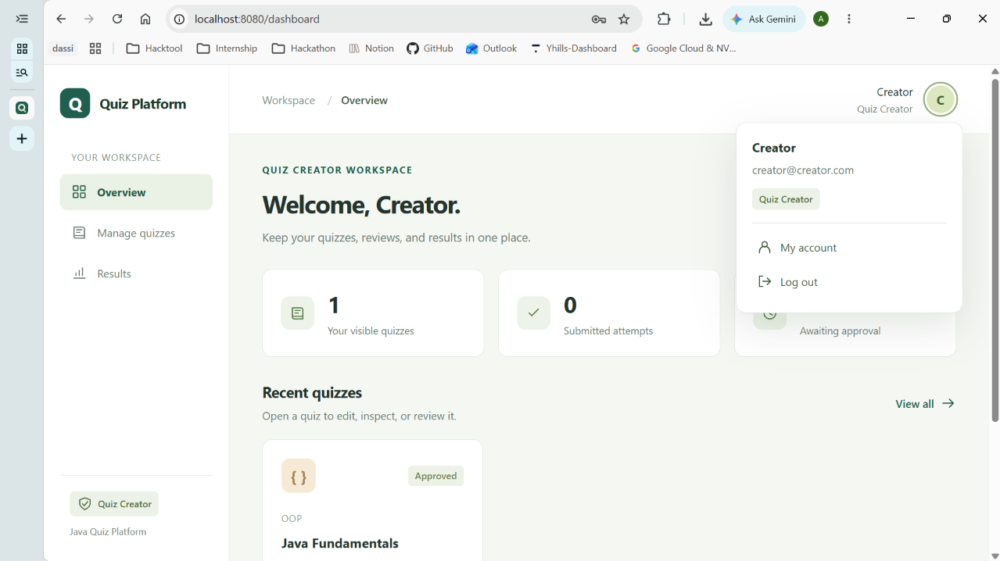

The Creator receives a different workspace from the Admin.

The Creator dashboard focuses on quiz authoring and the performance of
quizzes belonging to that creator. It does not expose the Admin's
**Manage users** capability.

The account menu in the top-right also shows the signed-in user's name,
email address, and actual role. This helps the user confirm which
account and permission level is currently active.

------------------------------------------------------------------------

## 6. Participant Dashboard

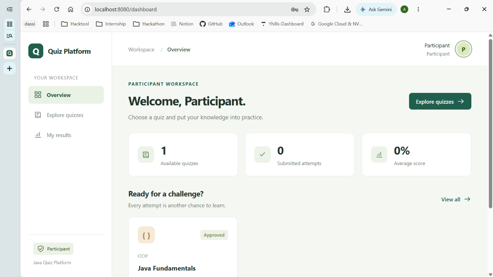

The Participant workspace is designed around taking quizzes rather than
managing the platform.

The dashboard displays information such as:

-   Available quizzes
-   Submitted attempts
-   Average score
-   Approved quizzes ready to attempt

The Participant navigation contains options such as **Explore quizzes**
and **My results**, rather than Admin management tools.

This separation is important: Participants are not given access to other
users' management data or the platform-wide result-management view.

------------------------------------------------------------------------

## 7. Quiz Details / Before You Begin

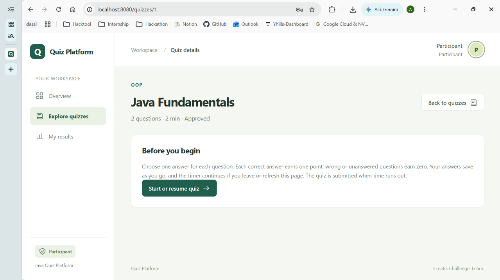

Before beginning an attempt, the Participant can inspect the quiz
summary.

The page displays the quiz title, category/topic, number of questions,
duration, and approval status.

It also explains the attempt rules. The Participant can then select
**Start or resume quiz**.

The resume behavior is backed by server-side attempt data rather than
only browser-local state.

------------------------------------------------------------------------

## 8. Timed Quiz Attempt

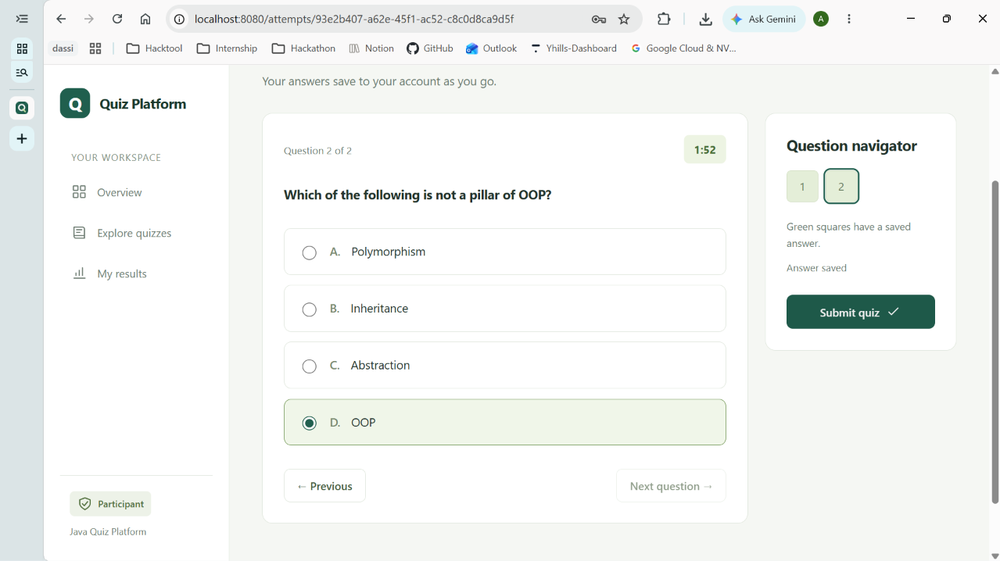

During an attempt, the Participant sees one question with four answer
choices and a countdown timer.

The **Question navigator** shows progress across the quiz. Saved answers
are visually indicated, and the Participant can move between questions.

The active attempt is stored by the backend so answer state and the
original deadline can survive a browser refresh.

------------------------------------------------------------------------

## 9. Submission Confirmation

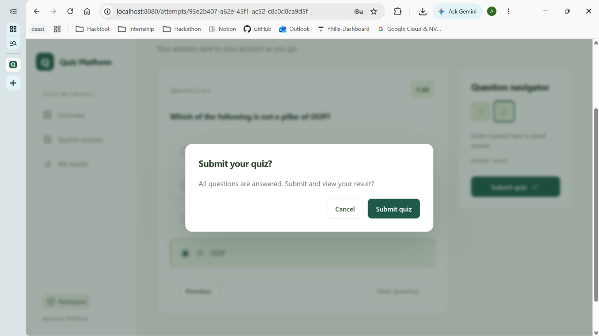

Before final submission, the application displays a confirmation dialog.

This reduces accidental submissions and gives the Participant a final
opportunity to return to the quiz.

Once submitted, the attempt is finalized and scored. Repeated submission
requests are handled so that the same attempt is not supposed to create
duplicate final results.

------------------------------------------------------------------------

## 10. Participant Result Report


After submission, the Participant receives a detailed attempt report.

The report includes:

-   Quiz title
-   Participant
-   Completion time
-   Number of correct answers
-   Percentage score
-   Time used

The Participant can then continue into the answer review.

------------------------------------------------------------------------

## 11. Answer Review

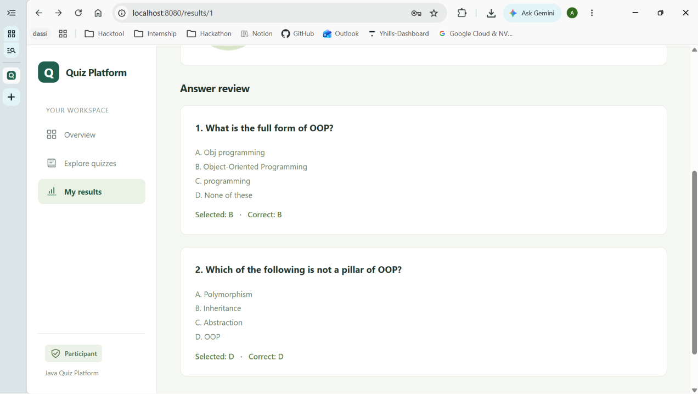

The answer review shows each question, its options, the Participant's
selected answer, and the correct answer.

Question explanations can also be retained in the result data.

Importantly, result reports use stored question snapshots. This means a
historical attempt can preserve the quiz content associated with that
attempt even if the quiz is edited later.

------------------------------------------------------------------------

## 12. Admin Results View

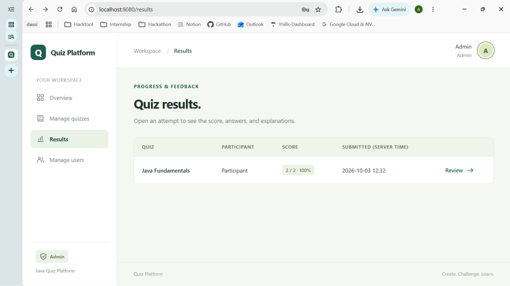

The Admin **Results** page provides a broader results view than the
Participant's **My results** page.

An Admin can inspect submitted attempts across the platform and open an
attempt for detailed review.

A Participant does not receive this platform-wide result-management
capability; their result history is restricted to the attempts they are
authorized to view.

------------------------------------------------------------------------

# Technology Stack

## Backend

**Java 17**

Java contains the application's main business logic, including
authentication, role checks, quiz operations, scoring, timing behavior,
result handling, and database access.

The browser edition uses Java's built-in HTTP server
(`com.sun.net.httpserver.HttpServer`) rather than Spring or a Servlet
framework.

## Frontend

-   HTML5
-   CSS3
-   Vanilla JavaScript

The frontend files are located in the `web/` directory.

JavaScript calls API routes on the same origin as the Java server.
Therefore, opening `web/index.html` directly is not equivalent to
running the complete application.

## Database

### Local development

**H2 Database 2.3.232**

Local development uses a file-backed H2 relational database through
JDBC.

The local database is created under:

`data/quiz.mv.db`

### Hosted / production mode

**PostgreSQL**

The hosted web edition is designed to use PostgreSQL through the
PostgreSQL JDBC driver.

The included driver is:

`postgresql-42.7.13.jar`

## Database Connectivity

**JDBC (Java Database Connectivity)**

The project uses:

-   `DriverManager`
-   `Connection`
-   `PreparedStatement`
-   `ResultSet`
-   Transactions
-   `commit()`
-   `rollback()`

No ORM such as Hibernate is required.

## Deployment

The repository contains:

-   `Dockerfile`
-   `render.yaml`
-   `.env.example`

The Docker build uses Eclipse Temurin Java 17.

------------------------------------------------------------------------

# Database Design and Persistence

The application stores important data in SQL rather than relying on
browser `localStorage`.

Core tables include:

  -----------------------------------------------------------------------
  Table                               Purpose
  ----------------------------------- -----------------------------------
  `users`                             User accounts, password hashes, and
                                      roles

  `quizzes`                           Quiz metadata, creator, duration,
                                      status, and review note

  `questions`                         Questions, four options, correct
                                      answer, and explanation

  `attempts`                          Completed quiz-attempt summaries

  `answers`                           Historical per-question answer
                                      snapshots

  `web_sessions`                      Browser authentication sessions

  `web_attempts`                      Active timed web attempts, saved
                                      answers, deadlines, and result link
  -----------------------------------------------------------------------

### Data persistence

When running locally, H2 stores data in the project `data/` directory.
Closing and reopening the application does not intentionally erase the
database.

In hosted production mode, the application requires a configured
PostgreSQL database. Accounts, quizzes, sessions, active attempts, and
results are stored on the database server rather than on one student's
laptop.

### Historical results

Completed attempts preserve their own question/answer information. This
prevents a later quiz edit from silently rewriting what a Participant
previously saw and answered.

------------------------------------------------------------------------

# Java and Review 1 Concepts

The project intentionally demonstrates the Java concepts required for
Review 1.

## Object-Oriented Programming

The project contains model classes such as:

-   `User`
-   `Quiz`
-   `Question`
-   `Attempt`

`Admin`, `QuizCreator`, and `Participant` extend `User` and provide
role-specific behavior.

## Inheritance and Polymorphism

The three account-role classes inherit from the common `User` model and
override role behavior such as `getRole()`.

## Interfaces and Generics

`Repository<T>` is a custom generic repository interface implemented by
DAO classes.

Collections used in the project include:

-   `List<Question>`
-   `Set<String>`
-   `Map<Integer, Integer>`

## Exception Handling

The project validates user input and handles SQL/application failures
rather than assuming every operation succeeds.

## Multithreading and Synchronization

The project includes concurrency in both editions.

The desktop quiz uses a countdown thread, while synchronized
`QuizSession` methods coordinate answer and completion state.

The web server uses a request thread pool and a scheduled executor for
expired attempts. Web attempt operations also contain
synchronization/transaction protection.

## JDBC CRUD Operations

DAO classes perform database operations for users, quizzes, and results.

CRUD operations are supported where appropriate:

-   **Create**
-   **Read**
-   **Update**
-   **Delete**

Deletion is intentionally restricted when deleting a record would damage
historical relationships.

## Prepared Statements

Database queries use JDBC `PreparedStatement` rather than constructing
normal SQL operations by blindly concatenating user input.

## Transaction Management

Important multi-step writes use SQL transactions.

For example, saving an attempt and its answers is treated as one logical
operation. If a required SQL operation fails, the transaction can be
rolled back instead of leaving a partially saved result.

------------------------------------------------------------------------

# Project Structure

``` text
QuizPlatform/
│
├── src/
│   └── quiz/
│       ├── Attempt.java
│       ├── Dashboard.java
│       ├── Database.java
│       ├── Json.java
│       ├── LoginWindow.java
│       ├── Main.java
│       ├── Passwords.java
│       ├── Question.java
│       ├── Quiz.java
│       ├── QuizDAO.java
│       ├── QuizEditor.java
│       ├── QuizSession.java
│       ├── QuizWindow.java
│       ├── Repository.java
│       ├── ResultDAO.java
│       ├── UI.java
│       ├── User.java
│       ├── UserDAO.java
│       ├── WebServer.java
│       └── WebStore.java
│
├── web/
│   ├── index.html
│   ├── style.css
│   ├── app.js
│   └── favicon.svg
│
├── database/
│   ├── schema.sql
│   └── web-schema.sql
│
├── lib/
│   ├── h2-2.3.232.jar
│   ├── postgresql-42.7.13.jar
│   └── H2-LICENSE.txt
│
├── docs/
│   └── screenshots/
│
├── Dockerfile
├── render.yaml
├── .env.example
├── .gitignore
├── run-web.bat
├── run-web.sh
├── run.bat
├── run.sh
├── build.bat
├── test.bat
├── START_HERE.md
├── WEB_START_HERE.md
├── REVIEW1.md
└── README.md
```

### Important Java files

  -----------------------------------------------------------------------
  File                                Responsibility
  ----------------------------------- -----------------------------------
  `WebServer.java`                    HTTP server, API routing, sessions,
                                      authorization, CSRF-related web
                                      handling, and static frontend
                                      serving

  `WebStore.java`                     Active web attempts, safe quiz
                                      views, saved answers, timing, and
                                      result-report support

  `Database.java`                     JDBC connections, local H2 / hosted
                                      PostgreSQL configuration, and
                                      database initialization

  `UserDAO.java`                      User persistence, account
                                      operations, and login-related
                                      database access

  `QuizDAO.java`                      Quiz persistence and approval
                                      workflow

  `ResultDAO.java`                    Result persistence and
                                      transactional attempt saving

  `User.java`                         User model and role subclasses

  `Quiz.java`                         Quiz model and question collection

  `Question.java`                     Question data, options, correct
                                      answer, and explanation

  `Attempt.java`                      Completed attempt summary

  `Repository.java`                   Generic repository interface

  `QuizSession.java`                  Synchronized desktop attempt/timer
                                      state

  `Json.java`                         Lightweight JSON encoding/decoding
                                      used by the web application

  `Dashboard.java`                    Desktop role dashboards and
                                      management screens

  `QuizEditor.java`                   Desktop quiz/question editor

  `QuizWindow.java`                   Desktop timed quiz interface

  `LoginWindow.java`                  Desktop login, registration, and
                                      initial setup

  `Passwords.java`                    Password hashing and verification
  -----------------------------------------------------------------------

------------------------------------------------------------------------

# Requirements

For local development, install:

-   **JDK 17 or newer**
-   A modern web browser
-   Git, if cloning from GitHub

No Maven installation is required for the supplied project structure.

To verify Java:

``` bash
java -version
javac -version
```

Both should resolve to Java 17 or newer when rebuilding the source.

------------------------------------------------------------------------

# Running the Web Application Locally

The browser version should be run through the Java server.

## Windows

### Step 1 --- Clone or download the repository

Using Git:

``` bash
git clone <YOUR-GITHUB-REPOSITORY-URL>
cd <YOUR-REPOSITORY-FOLDER>
```

Alternatively, download the repository ZIP from GitHub and extract it.

### Step 2 --- Start the web server

Double-click:

`run-web.bat`

or open a terminal in the project root and run:

``` bat
run-web.bat
```

### Step 3 --- Open the application

Open:

`http://localhost:8080`

The first local startup can print a setup key if the database does not
yet contain an administrator.

> Do not use VS Code Live Server to run the complete project. Live
> Server can serve frontend files, but it does not run the Java backend
> or the SQL-connected API.

## Linux / macOS

From the project root:

``` bash
sh run-web.sh
```

Then open:

`http://localhost:8080`

## Local database

Without production environment variables, the application uses the local
H2 database.

Do not run the desktop and browser editions against the same H2 database
file simultaneously.

------------------------------------------------------------------------

# Running the Desktop Application

The original Java Swing edition is preserved in the project.

## Windows

Run:

``` bat
run.bat
```

## Linux / macOS

Run:

``` bash
sh run.sh
```

## Rebuilding the Java application

On Windows, use:

``` bat
build.bat
```

On Linux/macOS, the equivalent build is:

``` bash
mkdir -p build
javac --release 17 -encoding UTF-8 -cp 'lib/*' -d build src/quiz/*.java
jar --create --file QuizPlatform.jar --main-class quiz.Main -C build quiz
```

------------------------------------------------------------------------

# First-Time Setup

On a new database, the system needs its first administrator.

For local web development, start the server and follow the setup screen
using the setup key printed/configured for that environment.

For hosted production, configure a secure `QUIZ_SETUP_TOKEN` of at least
24 characters before deployment.

After the first administrator has been created, normal accounts can be
created according to the application's role rules.

Do **not** publish real passwords or setup tokens in this README or in
source control.

------------------------------------------------------------------------

# Deploying the Web Application

The project contains a `Dockerfile` and a Render blueprint
(`render.yaml`).

The application can be deployed on a Java/Docker-compatible host with a
persistent PostgreSQL database.

## Production environment variables

  -----------------------------------------------------------------------
  Variable                            Purpose
  ----------------------------------- -----------------------------------
  `QUIZ_PRODUCTION`                   Set to `true` for production mode

  `DATABASE_URL`                      PostgreSQL connection URL; store it
                                      as a secret

  `QUIZ_SETUP_TOKEN`                  Random secret of at least 24
                                      characters used for initial Admin
                                      setup

  `PUBLIC_URL`                        Exact public HTTPS origin when
                                      required

  `PORT`                              Port assigned by the hosting
                                      provider; defaults to 8080 where
                                      appropriate
  -----------------------------------------------------------------------

Example variable names are documented in `.env.example`.

### Important

Production mode is designed to require PostgreSQL configuration. It
should not silently fall back to the laptop's H2 database.

The supplied `render.yaml` defines the web service but expects an
existing PostgreSQL database URL.

After deployment, replace the placeholder below with the actual public
address:

**Live Application:** https://quiz-platform-virginia.onrender.com

------------------------------------------------------------------------

# Security Notes

Because this repository may be submitted publicly:

-   Never commit a real `.env` file.
-   Never commit a real `DATABASE_URL`.
-   Never commit database usernames/passwords.
-   Never publish `QUIZ_SETUP_TOKEN`.
-   Never publish real user passwords.
-   Do not commit the local `data/` database directory.
-   Keep generated build directories and logs out of Git.

The included `.gitignore` already excludes important items such as:

``` text
.env
.env.*
data/
build/
build-web/
*.log
*.zip
```

while allowing `.env.example` to remain as documentation.

Application passwords are stored as hashes rather than plain-text
application passwords.

------------------------------------------------------------------------

# Testing and Verification

The supplied project documentation records the following verification
for this build:

-   Java sources compiled with Java 17.
-   39 backend checks passed for the original Review 1 implementation.
-   File-backed persistence was tested across application restarts.
-   Desktop quiz timing and result-saving behavior were tested.
-   HTTP integration checks covered registration/login, role checks,
    user CRUD, quiz CRUD, approval/rejection, result access, saved
    answers, simultaneous submissions, historical snapshots, expiry, and
    logout/login.
-   Frontend integration checks covered login, account menu, account
    creation, search, quiz creation/approval, participant navigation,
    answer saving, submission, and result display.

A deployed production host and its PostgreSQL service should still be
tested again after deployment because hosting configuration is
environment-specific.

------------------------------------------------------------------------

# Important Behaviour and Limitations

### Quiz deletion

A quiz with submitted results may be protected from deletion so
historical result records remain valid.

### User deletion

A user linked to quizzes or results may also be protected from deletion
for data-integrity reasons.

### Quiz editing

Editing quiz content can require the quiz to pass through the approval
workflow again before Participants receive the changed version.

### Retakes

Multiple quiz attempts are supported and stored separately.

### Timer

Quiz durations are validated by the backend. The supplied SQL schema
allows durations from 10 seconds up to 7200 seconds.

### Email

Email addresses are used as account/login identifiers. The application
does not claim to send verification emails.

### Web framework

The web edition uses Java's built-in HTTP server. It is **not** a Spring
application and does **not** claim Servlet implementation.

------------------------------------------------------------------------

# Summary

This project demonstrates a complete Java/JDBC quiz workflow with
separate responsibilities for administrators, quiz creators, and
participants.

The central idea is not simply to display quiz questions. The
application manages the complete lifecycle of a quiz:

**Create → Review → Approve → Attempt → Score → Persist → Review
Results**

The project also demonstrates core Java concepts required for academic
Review 1, including OOP, inheritance, polymorphism, interfaces,
generics, collections, exception handling,
multithreading/synchronization, JDBC CRUD operations, prepared
statements, and transaction management.

------------------------------------------------------------------------

## Repository Submission Checklist

Before submitting the GitHub link:

-   Ensure the repository is public if required by the evaluator.
-   Confirm `README.md` appears on the repository home page.
-   Add the `docs/screenshots/` directory supplied with this README.
-   Confirm the live Render URL in this README is reachable.
-   Verify `.env` and database secrets are not committed.
-   Verify the application can be started from the documented commands.
-   Test the public repository from a clean clone if possible.
